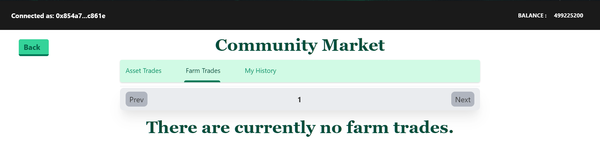

# Marketplace Section

The marketplace section offers two ways of creating your listings to trade your assets with other users.

.png>)

The marketplace allows players to create a listing of individual assets in bulk quantities at customized rates of their choice. This is the place where an individual trader can earn back the PINE he used to purchase from.

The are three tabs:

* **Asset trades** tab shows all the asset trades being sold in bulk.
* **Farm trades** tab shows the farms of different sizes along with the trees planted on them.
* **My History** tab shows filtered out asset trades only, providing a quick way to check if the status of the trade or to cancel them with ease if the asset trade list becomes quite long.

### States of trades

.png>)

Each trade has four states:

* **Cancel Trade** only appears on trades that were listed by the trader himself as he may cancel the trade before it is sold.
* **Purchase** allows one to purchase the trade at the given total rate in PINE.
* **Cancelled** and **Sold** are two states of a completed trade.

### Farm Slider in Marketplace

The **Farm Trades** operates in the very same way as the asset trade does. However, you can create a listing in the marketplace directly from the **Farm Section** on the **Main Page,** by pressing the **Sell** button.&#x20;

**Farm Slider** in the marketplace refers to the index where you want to place the farm that you may purchase in future. Please ensure that you do not already have a farm on that index before you purchase from the community market.
