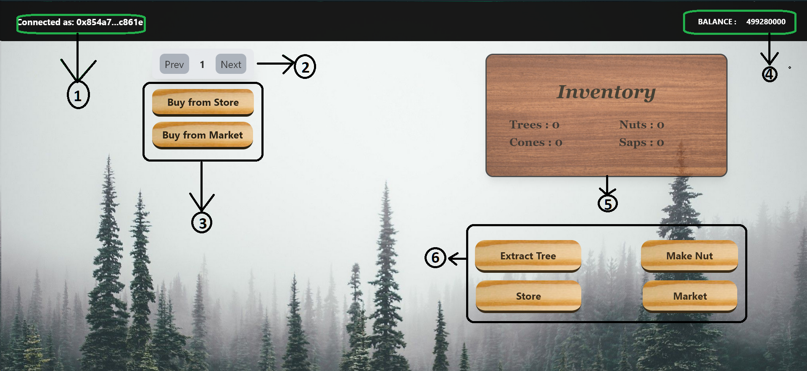

# Pine Farming

## Concept of Farming

Considering the PINE token's logo is the image of a pine tree, our team decided to bring up ideas, focusing on a DApp that included trees. Hence the idea of pine farming was derived where the players would be allowed to trade their assets with each other at competitive rates.&#x20;

## Aim of the Game

Following is the first/main screen of the game where the player is introduced to all the options to perform in the DApp after he logs in via Metamask:

1. Shows the address that you are connected with.
2. Depicts a farm slider where the player is provided with indexes 1 - 10 where he can purchase and allocate a farm to that index.
3. The first thing a player needs to do is purchase a farm to enjoy the full functioning of the game. He can either purchase a farm from the store at standard rates (expected to change with the PINE rate) or purchase directly from people who make offers in the community market.
4. Shows the balance or the amount of PINE owned in the selected address.
5. This is the dashboard of all the assets other than the farms that a person can own and trade (excluding the trees) in the game.
6. &#x20;**Extract Tree** is an option where 0 - 5 cones and 0 - 5 saps are randomly generated and added to your inventory. **Make Nut** allows a player to form a nut at the cost of one cone and one sap. **Store** and **Market** buttons may be used to reach their corresponding pages in the game.
